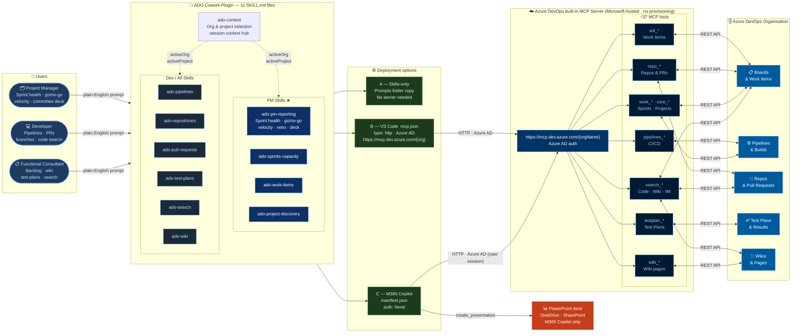

# ADO Cowork Plugin

An AI assistant plugin designed for **Project Managers** who need live Azure DevOps data
without leaving their chat window — and for developers and functional consultants who want
the same. Works with Microsoft 365 Copilot, VS Code Copilot agent mode, and any AI
assistant that supports the Agent Skills open standard (Claude Code, Cursor, Gemini CLI,
JetBrains Junie).

## Who is this for?

| Role | Primary workflows |
|---|---|
| **Project Manager** | Sprint health, go/no-go readiness, velocity trends, stakeholder updates, backlog grooming, retrospectives, committee PowerPoint decks |
| **Developer** | Pipeline triage, PR reviews, branch management, work item creation, commit history |
| **Functional consultant** | Work item queries, backlog triage, wiki authoring, cross-project search, test plan management |
| **Consultant / partner with guest access** | Register customer orgs once (`add org contoso`), then switch between your own and any customer Azure DevOps tenant in the same session |

## What this plugin does

Eliminates context-switching between your AI assistant and the Azure DevOps web portal.
Describe what you need in plain English — the plugin routes the request to the correct
Azure DevOps MCP tool and returns structured results directly in your chat window.

**For Project Managers:**

- "Give me the sprint health report for the Platform team — committed vs completed, slipped items."
- "Is v2.0 ready to go live? Show open P1 bugs, build status, and test pass rate."
- "What is our velocity trend over the last 4 sprints? What can we commit to Sprint 13?"
- "Prepare a PowerPoint deck for tomorrow's release committee call."
- "Publish the Sprint 12 retrospective notes to the wiki."

**For developers & functional consultants:**

- "What failed in the last pipeline run on `main` for repo `api-gateway`?"
- "Show me all open PRs assigned to me in the `backend` repository."
- "Find all code usages of `TokenService` across our repos."
- "Write the ADR for our new caching strategy to the Architecture wiki page."

**For consultants working across customer tenants:**

- "Add customer org contoso — I have guest access there."
- "Show me all my configured organisations and check which ones I can access."
- "Switch to the Fabrikam org and list their projects."
- "I'm now working on the Contoso engagement — use org contoso, project Finance."

---

## Architecture

Five layers — left to right: **who uses it → what skills handle it → how it connects →
what ADO tools it calls → where the data lives.** The PowerPoint output path (M365 only)
branches off above the ADO layer.



> **Rendered PNG:** [architecture.png](architecture.png) — for attaching to emails,
> presentations, and environments that do not render Mermaid inline.

---

## Repository structure

```
ado-cowork-plugin/
├── manifest.json                          # M365 App Manifest v1.28 (Cowork package)
├── color.png                              # 192x192 plugin icon (color)
├── outline.png                            # 32x32 plugin icon (outline)
├── architecture.png                       # Rendered architecture diagram (PNG)
├── architecture.mmd                       # Mermaid source for architecture.png
├── package.ps1                            # ASKILL validation + ZIP packaging
├── README.md                              # This file
├── EXAMPLES.md                            # Usage examples with sample prompts
├── CHANGELOG.md
├── CONTRIBUTING.md
├── PRIVACY.md
├── SECURITY.md
├── LICENSE
└── skills/
    ├── ado-project-discovery/
    │   └── SKILL.md
    ├── ado-work-items/
    │   └── SKILL.md
    ├── ado-sprints-capacity/
    │   └── SKILL.md
    ├── ado-pipelines/
    │   └── SKILL.md
    ├── ado-repositories/
    │   └── SKILL.md
    ├── ado-pull-requests/
    │   └── SKILL.md
    ├── ado-test-plans/
    │   └── SKILL.md
    ├── ado-search/
    │   └── SKILL.md
    ├── ado-wiki/
    │   └── SKILL.md    ├── ado-context/
    │   └── SKILL.md    └── ado-pm-reporting/
        └── SKILL.md
```

---

## Skills — Azure DevOps MCP tool coverage

| Skill | Audience | MCP tools covered | Use cases |
|---|---|---|---|
| `ado-context` | **All** | `core_list_projects` | Org & project selection, multi-project filtering, session context — **used by all other skills** |
| `ado-pm-reporting` | **PM** | `wit_query`, `wit_backlog`, `wit_work_item_write`, `work`, `work_iteration_write`, `work_capacity_write`, `pipelines_build`, `testplan_show_test_results_from_build_id`, `search_workitem`, `wiki_upsert_page` | Sprint health, go/no-go, velocity, stakeholder updates, backlog grooming, retrospectives, PowerPoint decks |
| `ado-sprints-capacity` | PM / Dev | `work`, `work_capacity_write`, `work_iteration_write` | Sprint setup, iteration management, team capacity |
| `ado-work-items` | PM / Dev | `wit_work_item`, `wit_work_item_write`, `wit_work_item_comment_write`, `wit_work_item_link_write`, `wit_work_item_attachment`, `wit_backlog`, `wit_query` | Create/update PBIs, bugs, tasks; backlog queries |
| `ado-project-discovery` | PM / All | `core_list_projects`, `core_list_project_teams` | Org structure, project list, team roster |
| `ado-pipelines` | Dev | `pipelines_build`, `pipelines_build_log`, `pipelines_run`, `pipelines_write`, `pipelines_definition`, `pipelines_artifact` | Build status, logs, triggering runs, pipeline YAML |
| `ado-repositories` | Dev | `repo_repository`, `repo_branch`, `repo_create_branch`, `repo_file`, `repo_search_commits` | Browse repos, files, branches, commit history |
| `ado-pull-requests` | Dev | `repo_pull_request`, `repo_pull_request_write`, `repo_pull_request_thread`, `repo_pull_request_thread_write` | PR review, approval, comments, thread resolution |
| `ado-test-plans` | Dev / QA | `testplan`, `testplan_show_test_results_from_build_id`, `testplan_test_case_write`, `testplan_test_plan_write`, `testplan_test_suite_write` | Test plan management, test case authoring, build results |
| `ado-search` | All | `search_code`, `search_wiki`, `search_workitem` | Cross-project code/wiki/work item search |
| `ado-wiki` | All | `wiki`, `wiki_upsert_page` | Read and write wiki pages |

---

## Deployment options

| Option | Target | Auth | Effort | Licences required |
|---|---|---|---|---|
| **A — Skills-only** | Any AI assistant | None | Copy a folder | GitHub Copilot (any plan) + Azure DevOps Basic |
| **B — Local MCP** | VS Code Copilot | Azure AD (auto) | Edit mcp.json | GitHub Copilot (any plan) + Azure DevOps Basic |
| **C — M365 Copilot** | Whole M365 tenant | None (upgradable to OAuthPluginVault) | Admin upload | Microsoft 365 Copilot + Azure DevOps Basic + Frontier preview |

---

## Licence requirements

### Azure DevOps (required for all options)

Every user who calls ADO MCP tools needs access to the Azure DevOps organisation.

| ADO licence | What it covers | Minimum needed |
|---|---|---|
| **Basic** (free up to 5 users, then ~$6/user/mo) | Work items, boards, repos, pipelines, wikis | ✅ Sufficient for all plugin features |
| **Basic + Test Plans** (~$52/user/mo) | All Basic features + test plan management | Only needed if using `ado-test-plans` skill |
| **Stakeholder** (free, unlimited) | View/create work items only — no repo/pipeline access | ⚠ Partial — PM-only read workflows may work; dev skills will not |
| **Visual Studio subscriber** | Included with VS Enterprise / Professional subscription | ✅ Fully covered |

> **Guest users in a customer tenant:** the guest still needs at least a **Basic** licence
> (or Stakeholder) assigned in that organisation by the customer's ADO admin. Being a guest
> in Azure AD is not enough on its own — ADO access level must be set separately.

---

### Option A — Skills-only licence requirements

| Licence | Plan | Notes |
|---|---|---|
| **GitHub Copilot** | Individual, Business, or Enterprise | Any plan works; Business/Enterprise needed for org-managed policies |
| **Azure DevOps** | Basic (or Stakeholder for read-only PM use) | No MCP calls are made — user pastes results manually; ADO web access is sufficient |

> **Cost to start:** GitHub Copilot Individual ($10/mo) + Azure DevOps Basic (free for ≤5 users).
> Effectively free for small teams already on GitHub Copilot.

---

### Option B — Local MCP licence requirements

| Licence | Plan | Notes |
|---|---|---|
| **GitHub Copilot** | Individual ($10/mo), Business ($19/user/mo), or Enterprise ($39/user/mo) | Agent mode (autonomous tool calls) requires VS Code 1.90+ with Copilot Chat |
| **Azure DevOps** | **Basic** minimum | MCP tools make live REST API calls — Stakeholder access is insufficient for pipeline, repo, and test plan operations |
| **VS Code** | Free | |

> **Agent mode availability:** GitHub Copilot agent mode (required for autonomous MCP
> tool calls) is available on all paid Copilot plans in VS Code 1.90+.

---

### Option C — M365 Copilot licence requirements ★ (recommended)

| Licence | SKU | Notes |
|---|---|---|
| **Microsoft 365 Copilot** | M365 Copilot add-on (~$30/user/mo) on top of M365 E3/E5 or Business Premium | Required for **each end-user** who will use the plugin |
| **Microsoft 365 E3 or E5** | or Microsoft 365 Business Premium | Base plan required — M365 Copilot is an add-on, not standalone |
| **Azure DevOps Basic** | Included with Visual Studio subscriptions or ~$6/user/mo | Required for each ADO user — same as Options A/B |
| **M365 Global Admin or Teams Admin** | Included in admin roles — no extra cost | Required once for the initial plugin upload to the Admin Centre |

> **Existing M365 E3/E5 tenants:** if your organisation already has M365 E3 or E5,
> the only additional licence needed is the **Microsoft 365 Copilot add-on** per user.

> **Visual Studio subscribers:** VS Enterprise and VS Professional subscriptions include
> an Azure DevOps Basic licence — no separate ADO licence purchase needed for those users.

#### Minimum licence set for a typical consulting team (Option C)

| Role | M365 Copilot | ADO licence | Notes |
|---|---|---|---|
| Project Manager | ✅ Required | Basic or Stakeholder | Stakeholder covers PM read/create WI workflows; Basic needed for full feature set |
| Developer | ✅ Required | Basic | Full access to all skills |
| Admin (setup only) | Optional | Not needed | Only needs M365 admin role to upload the plugin — no Copilot licence needed for the admin |

---

### Licence comparison summary

| Feature | Skills-only (A) | Local MCP (B) | M365 Copilot (C) |
|---|---|---|---|
| Azure DevOps Basic | Required | Required | Required |
| GitHub Copilot (any plan) | Required | Required | Not needed |
| Microsoft 365 Copilot add-on | Not needed | Not needed | Required |
| M365 E3/E5 or Business Premium | Not needed | Not needed | Required (base plan) |
| VS Code | Required | Required | Not needed |
| M365 Admin role | Not needed | Not needed | Required (one-time) |
| Estimated per-user cost | ~$10–39/mo | ~$10–39/mo | ~$36–69/mo |

> Pricing is indicative (USD, as of 2026). Check the
> [Microsoft 365 pricing page](https://www.microsoft.com/microsoft-365/business/compare-all-plans)
> and [Azure DevOps pricing page](https://azure.microsoft.com/pricing/details/devops/azure-devops-services/)
> for current rates in your region.

---

### Option A — Skills-only (fastest, no server required)

Copy the `skills/` folder into your VS Code prompts folder. The AI assistant follows the
skill workflow and you paste ADO tool results manually.

- Supported by: GitHub Copilot, Claude Code, Cursor, Continue.dev, Gemini CLI, JetBrains Junie
- No additional setup required

```powershell
.\package.ps1 -SkillsOnly   # copies skills/ to your VS Code prompts folder
```

---

### Option B — Local MCP (fully autonomous, single user)

Connect VS Code to the Azure DevOps MCP server. The assistant calls tools autonomously.

**Edit `%APPDATA%\Code\User\mcp.json`:**

```jsonc
{
  "servers": {
    "ADO-MyOrg": {
      "url": "https://mcp.dev.azure.com/YOUR_ORG_NAME",
      "type": "http"
    }
  }
}
```

Replace `YOUR_ORG_NAME` with the segment after `dev.azure.com/` in your browser URL.
Authentication is handled automatically by VS Code via your existing Azure AD session.
No PAT required.

---

### Option C — M365 Copilot (recommended · org-wide · main usage) ★

Publishes the plugin to your **Microsoft 365 tenant** so every Copilot user in the
organisation can use it without any local setup. This is the primary intended deployment
mode for Project Managers and teams.

#### Prerequisites

| Requirement | Notes |
|---|---|
| **Frontier preview program** | Your tenant must be enrolled — [sign up here](https://adoption.microsoft.com/en-us/copilot/frontier-program/) |
| **Frontier enabled on your admin account** | In M365 admin center: **Copilot → Settings → Frontier** — must be toggled ON for the uploading account specifically |
| Microsoft 365 Copilot licences | Required for end-users |
| Microsoft 365 admin centre access | Global Admin or Copilot Admin role |
| Azure DevOps organisation name | Segment after `dev.azure.com/` in your browser |
| `ado-cowork-plugin.zip` | Produced by `package.ps1` |

> **If Cowork is not visible in your admin center**, the Frontier toggle is not enabled on your account. Fix that first — the upload option will not appear without it.

#### Step 1 — Prepare manifest.json

Open [manifest.json](manifest.json) and replace the two placeholder values:

```jsonc
// Line to update — mcpServerUrl:
"mcpServerUrl": "https://mcp.dev.azure.com/YOUR_ORG_NAME"
//                                          ↑ replace with your ADO org name
```

```jsonc
// Line to update — id (optional but recommended — generate a fresh GUID):
"id": "e8b2a3f1-7c4d-4f91-b2e0-ad01c0ca0001"
//     ↑ replace with: [guid]::NewGuid().ToString() in PowerShell
```

> **Finding your org name:** open Azure DevOps in a browser →
> `https://dev.azure.com/{orgName}` — everything after `dev.azure.com/` is your org name.
> Example: `https://dev.azure.com/contoso` → org name is `contoso`.

#### Step 2 — Add icon files (required by M365)

The manifest references `color.png` (192×192 px) and `outline.png` (32×32 px, white
icon on transparent background).

Both icons are **already included** in the repository:

| File | Size | Description |
|---|---|---|
| `color.png` | 192×192 px | Azure blue (#0078d4) background with white **ADO** text |
| `outline.png` | 32×32 px | Transparent background with white **A** letter |

To replace them with custom branded icons, simply overwrite these two files with your own
PNGs at the same dimensions before running `package.ps1`.

#### Step 3 — Build the ZIP package

```powershell
cd C:\path\to\ado-cowork-plugin
.\package.ps1
# Produces: ado-cowork-plugin.zip
```

All 88 ASKILL validation checks run automatically. The ZIP is only produced if all pass.

#### Step 4 — Upload to Microsoft 365 Admin Centre

**For sideloading / testing:**

1. Open [https://admin.microsoft.com](https://admin.microsoft.com) and sign in.
2. Navigate to **Manage apps** (left navigation — not Settings).
3. Click **Upload custom app**.
4. Upload `ado-cowork-plugin.zip`.
5. Open **Cowork → Sources & Skills** — your skills should appear.

**For org-wide deployment:**

1. Open [https://admin.microsoft.com](https://admin.microsoft.com) and sign in.
2. Navigate to **Copilot → Agents → All agents**.
3. Find your uploaded plugin.
4. Under **Deploy to**, select **Entire organisation** or **Specific users/groups**.
5. Click **Deploy**.

> Deployment to the whole org propagates automatically — users do not need to install
> anything. The plugin appears in their Cowork **Sources & Skills** panel.

> **Can't find the upload option?** Make sure Frontier is enabled on your admin account
> (**Copilot → Settings → Frontier**). Without it, Cowork-specific features are not visible.

#### Step 5 — Validate in Microsoft 365 Copilot

After deployment propagates, open **Microsoft 365 Copilot** (copilot.microsoft.com or
the Copilot app in Teams) and type:

> "Show me all organisations I have access to in Azure DevOps."

The `ado-context` skill should activate and call `core_list_projects` on your configured
org. If the plugin is not responding, check:
- Open the **Sources & Skills** panel in Cowork — the plugin should appear there
- The plugin is enabled (toggle on in Sources & Skills)
- The `mcpServerUrl` in `manifest.json` matches your actual ADO org name (replace `contoso`)

#### Step 6 — Authentication

The current manifest uses `"type": "None"` for the MCP connector authorization:

```jsonc
"authorization": {
  "type": "None"
}
```

This means Cowork connects to `https://mcp.dev.azure.com/{orgName}` without injecting
an OAuth token. The Azure DevOps MCP server itself still enforces Azure AD authentication
for each user — the `None` type simply means no credential is pre-injected by the plugin
vault; users authenticate through their existing M365 session.

**To upgrade to full OAuthPluginVault for production** (each user consents once, token
stored in M365 vault, no prompts after that):
1. Register an OAuth client in [Teams Developer Portal](https://dev.teams.microsoft.com)
2. Set usage to **Any Microsoft 365 Organization**
3. Replace the authorization block in `manifest.json`:
   ```jsonc
   "authorization": {
     "type": "OAuthPluginVault",
     "referenceId": "YOUR_OAUTH_REGISTRATION_ID"
   }
   ```
4. Run `package.ps1` and redeploy.

#### Updating the plugin

To push an updated version:

1. Make changes to skills or manifest.
2. Bump `"version"` in `manifest.json` (e.g. `"1.0.0"` → `"1.1.0"`).
3. Run `.\package.ps1` to produce a new ZIP.
4. In M365 Admin Centre → **Copilot → Agents → All agents** → find **ADO Cowork** → **Update**.
5. Upload the new ZIP. Users get the update automatically.

---

## Prerequisites

See [Licence requirements](#licence-requirements) above for the full licence breakdown per option.

| Technical requirement | Skills-only | Local MCP | M365 Copilot |
|---|---|---|---|
| VS Code 1.90+ | Required | Required | Not needed |
| GitHub Copilot Chat | Required | Required | Not needed |
| Node.js / npm | Not needed | Not needed | Not needed |
| Azure DevOps PAT | Not needed | Not needed | Not needed |
| Azure subscription | Not needed | Not needed | Not needed |
| M365 Global / Copilot Admin | Not needed | Not needed | Required (one-time) |
| Frontier preview program | Not needed | Not needed | Required |

> **Options B and C both use the Azure DevOps built-in MCP endpoint**
> (`https://mcp.dev.azure.com/{orgName}`) — no npm package or Azure infrastructure to provision.

---

## Quick start (Local MCP — Option B)

**1. Add the server to VS Code `mcp.json`:**

Edit `%APPDATA%\Code\User\mcp.json` (user-wide) or `.vscode/mcp.json` (workspace) and
add the snippet from Option B above, replacing `YOUR_ORG_NAME` with your ADO organisation
name (the segment after `dev.azure.com/` in your browser URL).

**2. Sign in to Azure:**

VS Code uses your Azure AD session automatically (same account as the Azure extension).
No PAT is required. If prompted, sign in via `Azure: Sign In` in the command palette.

**3. Copy skills (optional — for Copilot skill routing):**

```powershell
.\package.ps1 -SkillsOnly
# or manually copy skills/ into your VS Code prompts folder
```

**4. Try it:**

> "Show me all projects in my Azure DevOps organisation."

---

## Security notes

- The ADO MCP endpoint (`https://mcp.dev.azure.com/{orgName}`) enforces **Azure AD
  authentication** at the platform level. No anonymous access is possible.
- VS Code (Option B) authenticates using your existing Azure AD session — no PAT, no
  service principal, no Key Vault required.
- M365 Copilot (Option C) uses `authorization.type: None` — the ADO MCP server still
  enforces Azure AD authentication per user at the platform level; secrets are never in
  source code or committed files. Upgrade to OAuthPluginVault for production (see Step 6).
- See [SECURITY.md](SECURITY.md) for least-privilege PAT scope guidance if your
  organisation requires PAT-based access instead of Azure AD.

---

## Contributing

See [CONTRIBUTING.md](CONTRIBUTING.md).

## License

MIT — see [LICENSE](LICENSE).
